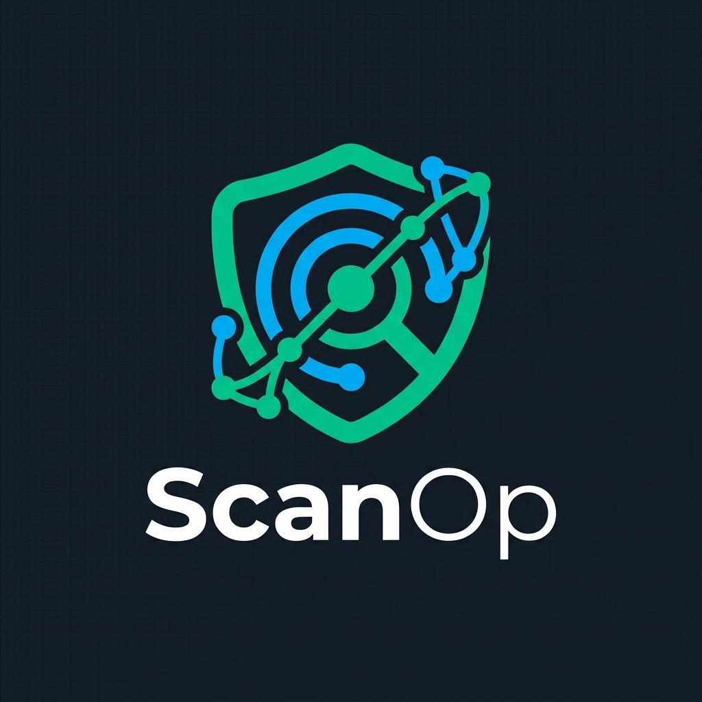

<div align="center">
  
  <h1>ScanOp</h1>
  <p><b>Centralized Antivirus Management & Monitoring for Windows Clients</b></p>

  
  
  
  
</div>

---

## About ScanOp

ScanOp is a lightweight web application for managing and monitoring **Windows Defender** antivirus scans across a network. It provides administrators with a centralized dashboard to view the security status of Windows laptops, trigger remote scans, and generate PDF/CSV reports.

## Features

| Category | Feature | Description |
| :--- | :--- | :--- |
| 🛡️ **Security** | **Centralized Management** | Trigger *Quick* or *Full Scans* via the web dashboard for individual laptops or the entire network. |
| 📊 **Monitoring** | **Live Status** | View client connection status, last scan times, and detected threats at a glance. |
| 📈 **Reporting** | **Daily Reports** | Export daily summaries as PDF or CSV for auditing purposes. |
| 🔄 **Updates** | **Remote Updates** | Deploy client script updates automatically via GitHub directly from the web interface. |
| 🔌 **Architecture** | **Secure API** | Polling-based architecture. Clients connect via HTTPS and authenticate using an API key. |

---

## Server Setup (Docker)

Deploying via Docker is the recommended approach. 

### 1. Download `docker-compose.yml`
Download the compose file to your host machine:
```bash
curl -o docker-compose.yml https://raw.githubusercontent.com/BitWuehler/ScanOp/main/docker-compose.yml
```

### 2. Configure Environment Variables
Edit the downloaded `docker-compose.yml` and set your variables:
* `SECRET_KEY`: A random string for session security.
* `SERVER_API_KEY`: The API key clients will use to authenticate.
* `APP_PASSWORD`: A **Bcrypt-hash** for the web dashboard login (You can use `python generate_secrets.py` locally to generate all three keys at once).

### 3. Start the Server
Start the container:
```bash
docker compose up -d
```

> [!TIP]
> **Updating:** To update the server to the latest release, run `docker compose pull && docker compose up -d`. The database in `./data` is persistent.

---

## Client Installation

A PowerShell installer is provided to connect Windows laptops to the server.

1. Go to the [Releases page](https://github.com/BitWuehler/ScanOp/releases) on GitHub.
2. Download and extract **`ScanOp-Client.zip`** from the latest release.
3. Run `start_installer.cmd` as Administrator.
4. Follow the prompts to enter your server URL, `SERVER_API_KEY`, and a client alias.

*(Unattended Installation: Place a `client_config.json` file in the extraction folder before running the installer to bypass interactive prompts).*

---

## Local Development

For development purposes:

1. **Clone & Setup:**
   ```bash
   git clone https://github.com/BitWuehler/ScanOp.git
   cd ScanOp
   python -m venv .venv
   source .venv/bin/activate  # Windows: .\.venv\Scripts\activate
   pip install -r requirements.txt
   ```
2. **Database & Environment:**
   Copy `.env.example` to `.env` and adjust the variables.
   Apply database migrations:
   ```bash
   alembic upgrade head
   ```
3. **Start Server:**
   ```bash
   uvicorn main:app --reload
   ```